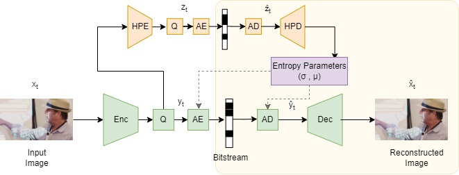

# Hyperprior Contextual Video Compression (HyCoVC)

Pytorch implementation of Hyperprior Contextual Video Compression Network using Variational Auto Encoder (VAE) and Generative Adversarial Networks (GANs).
Each branch consists of implementation for different variation of the network namely [__baseline__](https://github.com/AnandK27/HyCoVC/tree/baseline), [__context__](https://github.com/AnandK27/HyCoVC/tree/context), [__PWC__](https://github.com/AnandK27/HyCoVC/tree/PWC) and [__HyCoVC__](https://github.com/AnandK27/HyCoVC/tree/HyCoVC)

## [Report](https://github.com/AnandK27/HyCoVC/tree/HyCoVC/Report.pdf)

## Architecture


# Usage

## Training

* Download a large (> 100,000) dataset of diverse color images. We found that using 1-2 training divisions of the [OpenImages](https://storage.googleapis.com/openimages/web/index.html) dataset was able to produce satisfactory results on arbitrary images. [Fabian Mentzer's L3C Repo](https://github.com/fab-jul/L3C-PyTorch/) provides utility functions for downloading and preprocessing OpenImages (the trained models did not use this exact split). Add the dataset path under the `DatasetPaths` class in `default_config.py`. Check default config/command line arguments:

```bash
vim default_config.py
python3 train.py -h
```

* For best results, train an initial base model using the rate-distortion loss only, together with the hyperprior model, e.g. to target low bitrates:

```bash
# Train initial autoencoding model
python3 train.py --model_type compression --regime low --n_steps 1e6
```

* Then use the checkpoint of the trained base model to 'warmstart' the GAN architecture. Training the generator and discriminator from scratch was found to result in unstable training, but YMMV.

```bash
# Train using full generator-discriminator loss
python3 train.py --model_type compression_gan --regime low --n_steps 1e6 --warmstart --ckpt path/to/base/checkpoint
```

* Training after the warmstart for 2e5 steps using a batch size of 16 was sufficient to get reasonable results at sub-0.2 `bpp` per validation image, on average, using the default config in the `low` regime. You can change regimes to `med` or `high` to tradeoff perceptual quality for increased bitrate.

* Perceptual distortion metrics and `bpp` tend to decrease with a pareto-like distribution over training, so model quality can probably be significantly improved by training for an extremely large number of steps.

* If you get out-of-memory errors, try, in decreasing order of priority:
  * Decreasing the batch size (default 16).
  * Decreasing the number of channels of the latent representation (`latent_channels`, default 220). You may be able to reduce this quite aggressively as the network is highly over-parameterized - many values of the latent representation are near-deterministic.
  * Decreasing the number of channels used in the hyperprior.
  * Reducing the number of residual blocks in the generator (`n_residual_blocks`, default 7).
  * Training on smaller crops (`crop_size`, default `256 x 256`).

These options can be accessed through `/default_config.py`. While a larger architecture does not hurt performance, as the network can allow certain representations to be deterministic at near-zero entropy rates, decreasing the architecture size will allow for faster encoding/decoding.

* Logs for each experiment, including image reconstructions, are automatically created and periodically saved under `experiments/` with the appropriate name/timestamp. Metrics can be visualized via `tensorboard`:

```bash
tensorboard --logdir experiments/my_experiment/tensorboard --port 2401
```

## Compression

* `compress.py` will compress generic images under some specified entropy model. This performs a forward pass through the model to obtain the compressed representation, optionally coding the representation using a vectorized rANS entropy coder, which is then saved to disk in binary format. As the model architecture is fully convolutional, compression will work with images of arbitrary size/resolution (subject to memory constraints).

* For message transmission, separate entropy models over the latents and hyperlatents must be instantiated and shared between sender and receiver.
  * The sender computes the bottleneck tensor and calls the `compress()` method in `src/model.py` to obtain the compressed representation for transmission.
  * The receiver calls the `decompress()` method in `src/model.py` to obtain the quantized bottleneck tensor, which is then passed through the generator to obtain the reconstruction.

* The compression scheme in hierarchial in the sense that two 'levels' of information representing the latent and hyperlatent variables must be compressed and stored in the message, together with the shape of the encoded data.
  * In addition to the compressed data, some metadata about the shape of the latent and hyperlatent representations must be stored for correct decoding when saving the binary format '`.hfc`' to disk, as shown in [`src/compression/compression_utils.load_compressed_format`](../src/compression/compression_utils.py).

```bash
# Check arguments
python3 compress.py -h

# Only get reconstructions
python3 compress.py -i path/to/image/dir -ckpt path/to/trained/model --reconstruct

# Save compressed format to disk
python3 compress.py -i path/to/image/dir -ckpt path/to/trained/model --save
```

* Optionally, reconstructions can be generated by passing the `--reconstruct` flag. Decoding without executing the rANS coder takes around 2-3 seconds for ~megapixel images on GPU, but this can definitely be optimized. As evaluating the CDF under the hyperprior entropy model involves a series of matrix multiplications, decoding is significantly faster on GPU.

* Executing the rANS coder is slow and represents a performance bottleneck. Passing the `--vectorize` flag is much faster, but incurs a constant-bit overhead as the elements of the vectorized message must be initialized to some value, which introduces redundancy into the compressed message. The batch size needs to be quite large to make this overhead negligible. A fix is in the pipeline.
